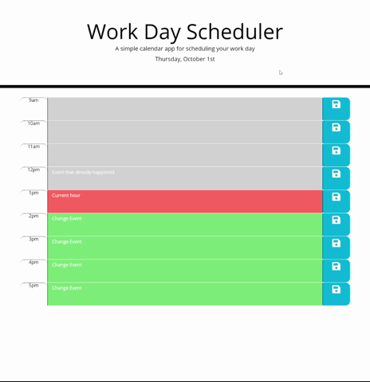

# 5-Work-Day-Scheduler

For this assignment we were tasked with creating a simple day planning application. Users can add a task for each hour of the work day by entering text. The task can be saved into the console memory. This is useful in case the user accidentaly closes the tab. 

The application runs in the browser and features dynamically powered HTML and CSS powered by jQuery. It also makes use of the Moment.js library to update the time and date. 

The application is deployed at https://26rsuarez.github.io/5-Work-Day-Scheduler/

